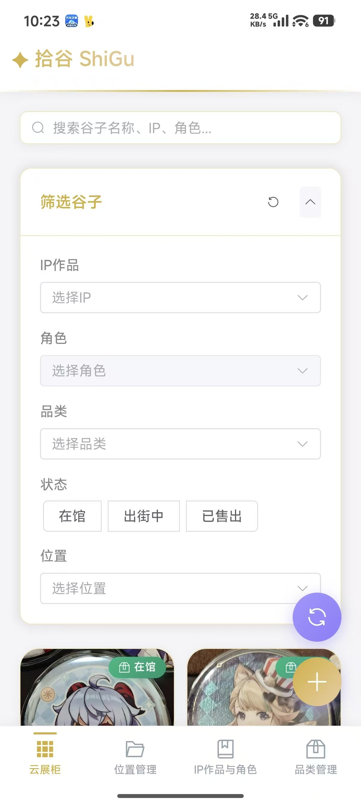
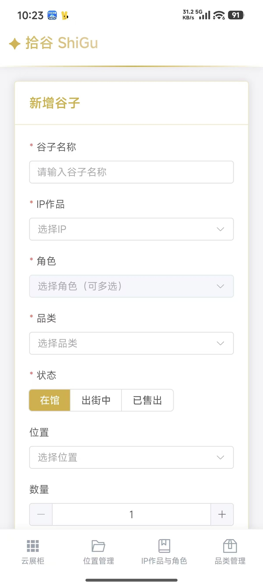
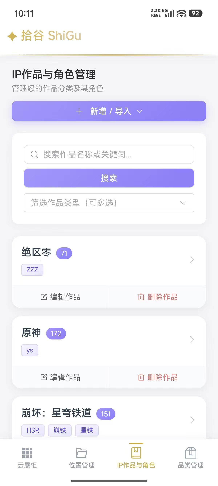
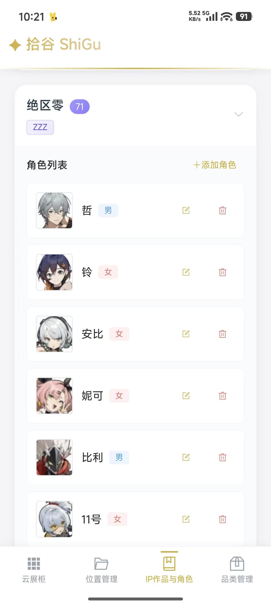
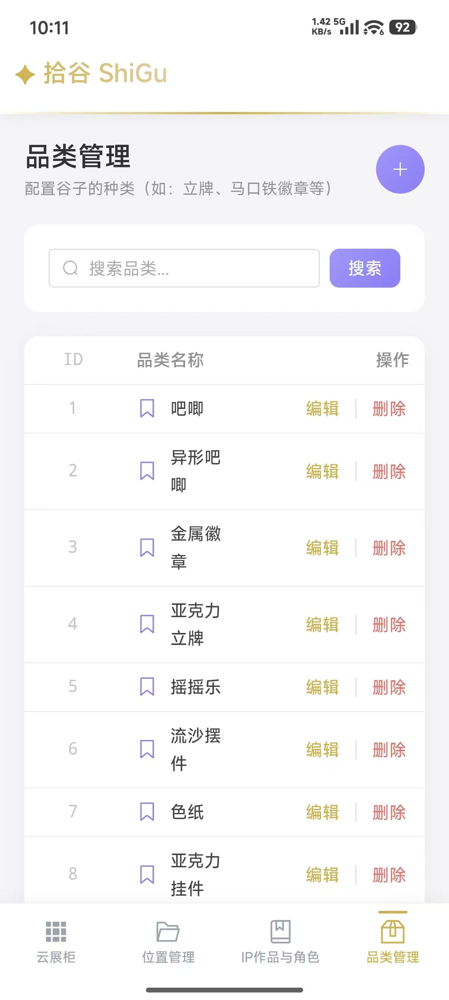

# 功能特性详细说明

本文档详细介绍了拾谷 PickGoods 平台的各项功能特性。

## 🎨 云展柜（Cloud Showcase）

**路由**：`/showcase` | **默认首页**

云展柜是拾谷的核心首页，通过顶部 Tab 将能力拆分为三个子模块：

| Tab | 功能定位 | 主要组件 |
|-----|---------|---------|
| **展柜** | 云展柜展示与编排，支持自定义展柜文件夹和展示布局 | `ShowcaseManager` |
| **谷仓** | 谷子资产检索与列表展示（搜索 + 筛选 + 分页） | `SearchBar` + `FilterPanel` + `GoodsCard` |
| **统计看板** | 资产统计与可视化分析 | `StatsDashboard` |

### 展柜 Tab

展柜模块用于创建和管理个性化的云展柜，支持：
- 创建多个展柜文件夹
- 将谷仓中的谷子添加到展柜
- 自定义展柜封面与描述
- 预览展柜内容马赛克缩略图

**组件依赖**：`ShowcaseManager.vue`、`ShowcaseFolderCard.vue`、`ShowcaseListView.vue`、`ShowcaseDetailView.vue`、`ShowcasePreviewMosaic.vue`

### 谷仓 Tab

谷仓模块是原有的谷子检索与列表展示功能：

| 功能 | 说明 | 技术实现 |
|------|------|----------|
| 🔍 **智能搜索** | 300ms 防抖搜索，避免频繁请求触发限流 | `lodash-es` 防抖 + Pinia Store |
| 🎯 **多维筛选** | IP、角色、品类、状态、位置、官谷/同人等多维度筛选 | `FilterPanel` 组件 + 动态查询参数 |
| 📱 **响应式布局** | PC 端网格展示，移动端卡片展示，自动适配 | CSS Grid + Flexbox + 媒体查询 |
| 📖 **详情抽屉** | 点击卡片弹出详情抽屉，展示完整信息与图片画廊；移动端支持底部弹出与拖拽手势（半屏/全屏切换） | `GoodsDrawer` 组件 + Element Plus Drawer + 移动端手势优化 |
| 📄 **分页导航** | 固定在底部，毛玻璃效果，不遮挡内容 | 自定义样式 + `el-pagination` |
| ⚡ **快捷操作** | 右键菜单提供编辑、删除、前移/后移排序等快捷操作 | 自定义右键菜单组件 |
| 🔄 **排序功能** | 支持谷子前移/后移排序，支持跨页排序，智能边界检测 | `moveGoods` API + 跨页锚点机制 |
| 🔗 **位置跳转** | 点击位置路径跳转到位置管理页并高亮 | Vue Router 编程式导航 |

**组件依赖**：`SearchBar.vue`、`FilterPanel.vue`、`GoodsCard.vue`、`GoodsDrawer.vue`

### 通用交互

| 功能 | 说明 | 技术实现 |
|------|------|----------|
| 🔃 **刷新功能** | 悬浮刷新按钮，根据当前 Tab 刷新对应数据 | Pinia Store 刷新方法 + 事件总线 |
| ➕ **悬浮按钮组** | 云展柜页面右下角悬浮按钮组：刷新按钮（紫色渐变）+ 新增按钮（仅谷仓 Tab 显示，金色渐变），移动端自动适配安全区域 | 固定定位 + 渐变背景 + 动画效果 |
| 📱 **移动端底部导航** | 移动端底部固定导航栏，快速切换主要页面 | `MobileBottomNav.vue` |

---

## 📊 统计看板（Stats Dashboard）

**位置**：`/showcase` 页面顶部 Tab 中的「统计看板」

针对当前筛选条件，对谷子资产进行多维度统计与可视化展示。

| 功能 | 说明 | 技术实现 |
|------|------|----------|
| 📈 **资产概览指标** | 展示谷子件数、总数量、估算总金额等核心指标 | `GoodsStatsOverview` + 概览卡片组件 |
| 🔎 **多维统计筛选** | 支持按时间粒度（按日/周/月）、Top N、官谷/同人、状态、IP、品类、入手日期、录入日期等维度筛选 | 组合表单 + `GoodsStatsParams` 查询参数 |
| 🧩 **状态分布图** | 展示在馆/出街中/已售出占比 | ECharts 环形图（状态分布） |
| 🎭 **官谷/同人结构** | 统计官谷与同人占比 | ECharts 环形图（`is_official` 分布） |
| 🎬 **作品类型结构** | 统计动画/游戏/书籍等不同作品类型的分布 | ECharts 柱状图（`ip_subject_type` 分布） |
| 🏆 **IP Top N** | 按件数统计 IP Top N，支持调整 N（3-30） | 横向条形图（`ip_top`） |
| 📦 **品类 Top N** | 按件数统计品类 Top N，支持展示品类路径名 | 横向条形图（`category_top`） |
| 🔄 **自动与手动刷新** | 筛选条件变更自动刷新；云展柜右下刷新按钮在「统计看板」Tab 下会触发整体重算 | `getGoodsStats` 接口 + 事件总线（`cloud-showcase:stats-refresh` 等） |

**关键交互说明**：

- 在「统计看板」Tab 下，云展柜右下角的刷新按钮会触发整套统计数据重算，并在完成后反馈至上层布局（`cloud-showcase:stats-refresh-complete` → `cloud-showcase:refresh-complete`）
- 筛选条件（时间粒度、Top N、状态、IP、品类、日期区间等）变更时，会自动以 300ms 简单防抖重新请求统计数据，避免频繁请求
- 当当前筛选条件下没有任何统计数据时，会给出「暂无统计数据」的友好提示

---

### 云展柜界面展示

#### PC 端界面（谷仓 Tab）

*PC 端云展柜 - 谷仓 Tab 网格展示与多维筛选*

#### 移动端界面（谷仓 Tab）

*移动端谷仓 - 卡片式展示*

*移动端筛选面板 - 多维筛选器*

---

## 📍 位置管理（Location Management）

**路由**：`/location`

层级化位置管理，支持树形导航与位置详情展示。

| 功能 | 说明 | 技术实现 |
|------|------|----------|
| 🌳 **树形导航** | 树形结构展示收纳位置，支持展开/折叠 | Element Plus Tree + 递归组件 |
| 📋 **位置详情** | 展示位置名称、描述、照片等详细信息 | 侧边详情面板 |
| 📦 **位置资产** | 展示该位置下的所有谷子列表 | 联动查询，基于位置的筛选 |
| ✏️ **CRUD 操作** | 支持位置的增删改操作 | RESTful API + 表单校验 |
| 🔍 **位置搜索** | 支持按路径名称搜索位置节点 | 前端过滤或后端查询 |

**状态管理**：`stores/location.ts` - 管理位置树状态

---

## 📝 资产录入（Goods Form）

**路由**：`/goods/new`（新增） | `/goods/:id/edit`（编辑）

完整的资产录入与编辑表单，支持图片上传与联动选择。

| 功能 | 说明 | 技术实现 |
|------|------|----------|
| ✅ **表单校验** | 完整的字段校验规则，实时反馈错误 | Element Plus Form 校验规则 |
| 🔗 **联动选择** | IP-角色联动选择，避免选择无效组合 | 级联选择器 + 数据过滤 |
| 👥 **多角色关联** | 支持一个谷子关联多个角色 | 多选下拉框 + 后端 `character_ids` 字段 |
| 📷 **图片上传** | 主图上传功能，已对接后端接口 | FormData + Axios 文件上传 |
| ✂️ **图片裁剪** | 支持图片上传前裁剪，多种裁剪比例（1:1、4:3、16:9等），自由裁剪模式 | `vue-picture-cropper` + Cropper.js |
| 📸 **原生相机** | 移动端支持调用原生相机拍照，自动集成到上传流程 | Capacitor Camera 插件 |
| 🖼️ **补充图片** | 补充图片完整管理功能：上传、删除、标签管理、预览 | 图片上传 API + 标签编辑 + 图片预览组件 |
| ⚠️ **冲突检测** | 409 冲突检测，友好的幂等性提示 | HTTP 状态码处理 |

**API 接口**：
- `POST /api/goods/` - 创建谷子
- `PUT /api/goods/{id}/` - 更新谷子
- `POST /api/goods/{id}/upload-main-photo/` - 上传/更新主图
- `POST /api/goods/{id}/upload-additional-photos/` - 上传/更新补充图片（支持批量上传、标签管理）
- `DELETE /api/goods/{id}/additional-photos/{photoId}/` - 删除单张补充图片
- `DELETE /api/goods/{id}/additional-photos/` - 批量删除补充图片

**界面展示**：

*PC 端资产录入表单*

*移动端资产录入表单 - 响应式布局*

---

## 🎭 IP作品与角色管理（IP & Character Management）

**路由**：`/ipcharacter` | **兼容路由**：`/ip`、`/character`（自动重定向）

统一管理 IP 作品与角色，支持 BGM 批量导入与关键词管理。

| 功能 | 说明 | 技术实现 |
|------|------|----------|
| 📊 **列表展示** | PC 端表格展示，移动端卡片展示 | 响应式表格组件 |
| 🔽 **展开/折叠** | IP 下角色列表展开/折叠查看，懒加载优化 | Element Plus Table expand |
| 🏷️ **关键词管理** | IP 关键词管理（别名/缩写），支持多关键词 | 标签组件 + CRUD 操作 |
| 📸 **头像上传** | 角色头像上传功能 | 图片上传组件 |
| 🔍 **搜索功能** | 按 IP 名称或关键词搜索 | 前端过滤 + 后端查询 |
| ⭐ **BGM 导入** | 从 Bangumi 批量导入 IP 作品与角色 | 多步骤流程 + 批量创建 API |

### BGM 批量导入流程

1. **搜索作品**：通过 Bangumi API 搜索作品
2. **选择角色**：展示角色列表，支持筛选与批量选择
3. **批量导入**：调用后端批量创建接口
4. **结果反馈**：展示导入结果统计（成功创建、已存在跳过、错误详情）

**API 接口**：
- `POST /api/bgm/search-characters/` - 搜索 Bangumi 作品并获取角色列表
- `POST /api/bgm/create-characters/` - 批量创建 IP 和角色

**界面展示**：

#### PC 端界面

*PC 端 IP 作品与角色管理 - 表格展示与展开/折叠*

#### 移动端界面

*移动端 IP 管理 - 卡片式展示*

*移动端角色列表展示 - 展开查看角色详情*

#### BGM 批量导入流程展示

*步骤 1：搜索 Bangumi 作品*

*步骤 2：选择角色并批量导入*

---

## ⚙️ 设置（Settings）

**路由**：`/settings`

配置应用级别的后端服务地址，支持运行时修改而无需重新构建前端。

| 功能 | 说明 | 技术实现 |
|------|------|----------|
| 🔗 **后端地址配置** | 通过表单配置后端 API 基础地址，立刻生效 | 使用 `updateBaseURL` 写入本地存储并更新 Axios 实例 |
| 🧠 **默认地址推断** | 默认根据当前页面协议与主机推断后端地址 | `protocol://hostname:8000` 作为默认值（如 `http://127.0.0.1:8000`） |
| 💾 **持久化存储** | 配置保存在浏览器 `localStorage` 中 | 使用键名 `pickgoods_api_base_url`，兼容旧键 `shigu_api_base_url` |
| 🧹 **恢复默认** | 一键恢复至默认后端地址 | 调用 `resetBaseURL` 清理本地存储并还原默认地址 |

**使用场景**：
- 在局域网或测试环境中，前端访问不同后端实例（如开发/测试/预发布）
- 打包为移动端应用后，通过设置页切换到真实线上 API，而不是写死为 `localhost`

**技术实现**：
- 使用 `localStorage` 持久化存储后端地址（键名：`pickgoods_api_base_url`，兼容旧键 `shigu_api_base_url`）
- 每次请求前动态获取 `baseURL`，确保设置页修改后立即生效
- 提供 `updateBaseURL`、`getCurrentBaseURL`、`resetBaseURL` 等工具函数

---

## 📱 移动端优化特性

项目针对移动端体验进行了深度优化，提供原生应用级别的交互体验。

| 功能 | 说明 | 技术实现 |
|------|------|----------|
| 📱 **底部导航栏** | 移动端底部固定导航栏，支持快速切换主要页面 | `MobileBottomNav` 组件 + 安全区域适配 |
| 🎯 **详情抽屉拖拽** | 移动端详情抽屉支持拖拽手势，半屏/全屏切换 | Touch 事件监听 + 动态高度计算 |
| 🔄 **手势优化** | 移动端抽屉支持上拉展开、下拉收起，流畅的手势反馈 | 触摸事件处理 + 防抖优化 |
| 📐 **安全区域适配** | 适配 iOS/Android 刘海屏、底部安全区域 | CSS `env(safe-area-inset-*)` + 动态 padding |
| 🎨 **页面标题自动设置** | 路由切换时自动更新浏览器标题 | Vue Router 导航守卫 |

**移动端原生相机与图片裁剪**：
- 支持调用原生相机拍照，自动集成到图片上传流程
- 图片上传前支持裁剪，提供多种裁剪比例（1:1、4:3、16:9等）和自由裁剪模式
- 使用 `vue-picture-cropper` 组件，提供流畅的裁剪体验
- 移动端触摸优化，支持手势操作

**移动端底部导航栏**：
- 固定在屏幕底部，支持安全区域适配
- 包含"云展柜"、"位置管理"、"IP作品与角色"、"品类管理"四个主要入口
- 自动高亮当前激活的路由
- 仅在移动端（屏幕宽度 < 768px）显示

**移动端详情抽屉优化**：
- PC 端：右侧滑出抽屉（固定宽度 600px）
- 移动端：底部弹出抽屉（默认 65% 高度，支持拖拽调整）
- 支持拖拽手势：在头部区域上下拖拽，可在半屏（65%）和全屏（90%）之间切换
- 智能滚动处理：内容区域滚动时不影响抽屉拖拽
- 流畅的动画效果和过渡状态

---

## 📦 品类管理（Category Management）

**路由**：`/category`

独立的品类管理页面，支持品类的完整 CRUD 操作。

| 功能 | 说明 | 技术实现 |
|------|------|----------|
| 📋 **列表展示** | 表格形式展示品类列表（PC端），卡片形式展示（移动端） | Element Plus Table + 响应式布局 |
| 🔍 **搜索功能** | 按品类名称搜索 | 前端过滤或后端查询 |
| ✏️ **CRUD 操作** | 支持品类的增删改操作 | RESTful API + 表单校验 |
| 🔄 **拖拽排序** | PC 端和移动端均支持拖拽排序，仅允许同一父级内部排序 | `sortablejs` + 批量更新排序 API |

**界面展示**：

*移动端品类管理界面 - 表格展示与搜索功能*

